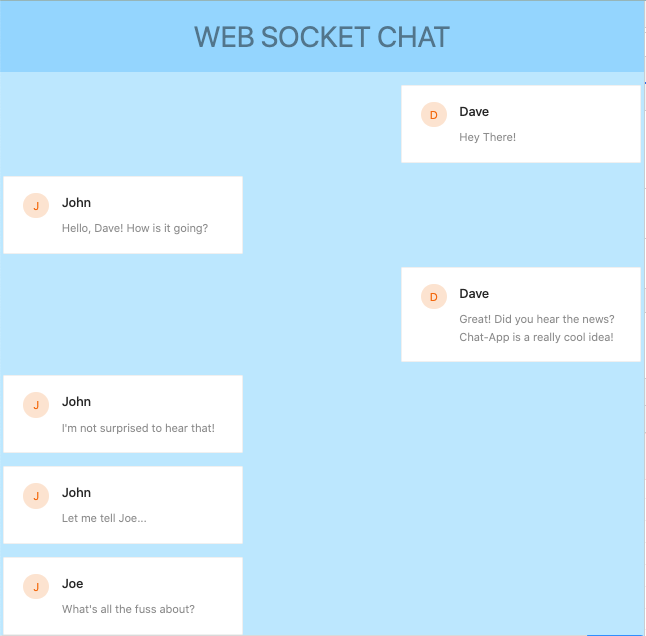
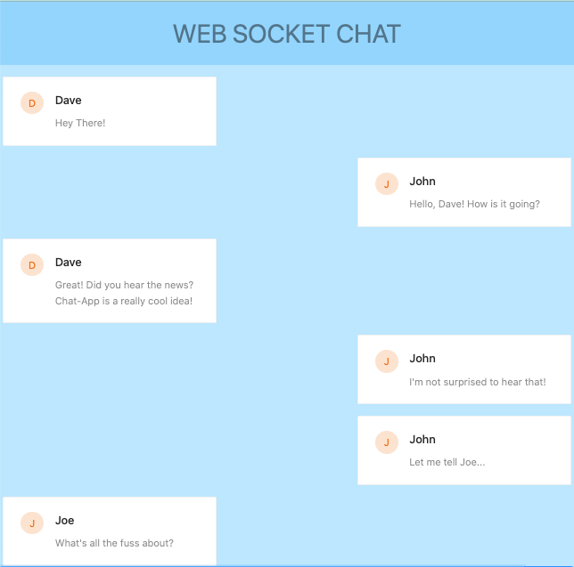
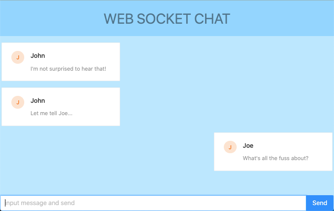

# chat-app
Chat App uses WebSockets to take messages and display them back to the client.

## Start
To start the app, open two terminals.

First, use `cd ./webSocketsServer` and run `npm install`.

Next, run `npm start` which will start the server code. 

When the server is started, go to the other terminal.

Then, use `cd ./webSocketsClient` and run `npm install` again.

Finally run `npm start` which will start the client.

If the client is running successfully, you will see `http://localhost:1992` open in the browser.

Happy Testing :-)

## Screenshots:

#### Dave starts the chat w/ John:

#### John receives the chat, responds, and invites Joe:

#### Joe joins late:

